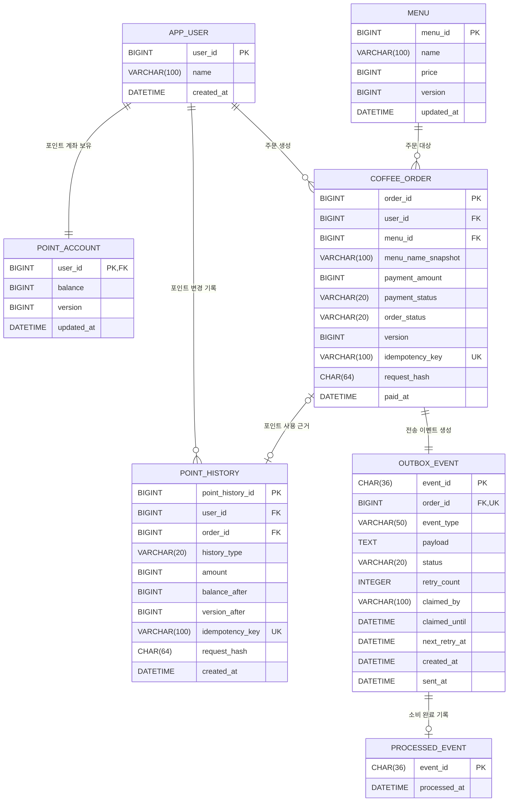

# 다수 서버 환경에서도 안정적으로 동작하는 커피 주문 시스템

## 1. 프로젝트 목적

대형 카페 브랜드의 모바일 주문 서비스를 가정한다. 이 프로젝트의 목적은 API 수를 늘리는 것이 아니라, 제한된 요구사항 안에서 동시성, 중복 요청, 트랜잭션, 외부 시스템 장애와 대규모 트래픽 문제를 분석하고 선택한 해결 전략을 코드와 테스트로 검증하는 것이다.

기술을 먼저 선택하지 않는다. 사용자 흐름과 비즈니스 불변식을 정의한 뒤 실제로 발생할 수 있는 문제에 필요한 기술만 적용한다. 선택한 기술의 장점뿐 아니라 운영 비용과 단점, 재검토 조건도 함께 기록한다.

### 구현 범위

- 커피 메뉴 목록 조회
- 포인트 충전
- 포인트를 이용한 주문 및 결제
- 주문 내역의 데이터 수집 플랫폼 실시간 전송
- 고객의 주문 상태 실시간 조회
- 주방의 주문 목록 조회와 수동 조리 상태 변경
- 최근 7일 인기 메뉴 3개 조회

### 구현하지 않는 범위

- 장바구니
- 메뉴 검색 및 조회수 기반 인기 메뉴
- 카테고리와 상세 옵션
- 카드 및 현금 결제
- 추천 시스템
- 고객 서버와 주방 서버의 독립 DB 기반 마이크로서비스 분리

## 2. 핵심 운영 가정

초기 설계부터 무제한 확장을 목표로 하지 않는다. 대형 카페 브랜드의 피크 시간을 가정하여 아래 수치를 최초 부하 테스트 기준으로 사용하고, 측정 결과에 따라 확장한다.

- 목표 주문 처리량: 약 200 TPS
- 목표 메뉴 조회량: 약 1,000 RPS
- 전체 요청량은 크지만 포인트 데이터는 사용자별로 분리되어 동일 사용자의 동시 수정 빈도는 비교적 낮다고 가정한다.
- 주문 서버와 데이터 수집 플랫폼은 독립적으로 장애가 발생할 수 있다.

위 수치는 실제 운영 통계가 아니라 설계 검증을 위한 가설이다. 응답 지연, DB 커넥션 풀 사용률, 낙관적 락 충돌률, Kafka Consumer Lag을 측정하여 가정을 검증한다.

### 2.1 서버 역할

- 하나의 코드베이스를 고객 서버와 주방 서버 역할로 나누어 실행한다.
- 고객 서버는 메뉴·포인트·주문 요청과 고객 주문 상태 구독을 담당한다.
- 주방 서버는 준비 중 주문 조회, 조리 시작·완료 명령과 주방 주문 채널 구독을 담당한다.
- 두 서버는 MySQL을 주문 상태의 최종 원본으로 사용하고 Redis Pub/Sub으로 커밋된 변경 알림을 공유한다.
- 역할별 서버 분리는 독립 DB를 가진 마이크로서비스 분리를 의미하지 않는다.

## 3. 사용자 시나리오

### 3.1 메뉴 조회

1. 사용자가 커피 메뉴 목록을 요청한다.
2. 시스템은 메뉴 ID, 이름, 가격을 반환한다.
3. 사용자는 주문할 메뉴를 선택한다.

### 3.2 포인트 충전

1. 사용자가 충전 금액을 입력한다.
2. 클라이언트는 사용자 식별값, 충전 금액, 멱등성 키, 사용자가 확인한 포인트 버전을 전송한다.
3. 시스템은 사용자와 요청값을 검증한다.
4. 동일한 멱등성 키가 이미 처리되었다면 포인트를 다시 충전하지 않고 기존 결과를 반환한다.
5. 사용자가 확인한 버전과 현재 포인트 버전이 다르면 충전을 거절하고 최신 잔액을 반환한다.
6. 검증이 완료되면 잔액 증가와 충전 내역 저장을 하나의 트랜잭션으로 처리한다.

### 3.3 주문 및 결제

1. 사용자가 메뉴를 선택하고 주문을 요청한다.
2. 시스템은 메뉴 ID로 현재 메뉴와 가격을 조회한다.
3. 사용자가 확인한 메뉴 정보 또는 포인트 버전이 현재 데이터와 다르면 자동 결제하지 않고 재확인을 요구한다.
4. 시스템은 포인트 잔액이 주문 금액 이상인지 확인한다.
5. 포인트 차감, 주문 생성, 전송 이벤트 저장을 하나의 트랜잭션으로 처리한다.
6. 모든 작업이 성공하면 커밋하고 하나라도 실패하면 전체 롤백한다.
7. 커밋된 주문 이벤트는 Kafka를 통해 데이터 수집 플랫폼으로 전달한다.

### 3.4 주방 주문 처리

1. 주문과 포인트 결제가 성공하면 결제 상태는 `PAID`, 주문 상태는 `PREPARING`으로 저장된다.
2. 주방 화면은 준비 중 주문을 조회하고 커밋된 주문 알림을 실시간으로 받는다.
3. 주방 작업자가 주문을 확인하고 조리 시작을 누르면 `COOKING`으로 변경한다.
4. 주방 작업자가 실제 조리를 마치고 완료를 누르면 `COMPLETED`로 변경한다.
5. 주문 상태는 시간 경과나 메시지 수신만으로 자동 변경하지 않는다.
6. 고객 화면은 주문별 채널에서 상태 변경을 받고 재연결 시 현재 상태를 다시 조회한다.

### 3.5 인기 메뉴 조회

1. 사용자가 인기 메뉴 목록을 요청한다.
2. 시스템은 조회 시점부터 최근 7일간 결제가 완료된 주문을 메뉴별로 집계한다.
3. 주문 횟수가 많은 순서로 상위 3개 메뉴를 반환한다.

## 4. 비즈니스 정책과 불변식

- 유효한 사용자 식별값 없이는 포인트를 충전하거나 주문할 수 없다.
- 충전 금액은 0보다 커야 한다.
- 동일한 충전 요청과 주문 요청은 한 번만 반영한다.
- 사용자가 확인한 포인트 버전이 오래되었다면 자동 재시도하지 않고 최신 상태를 다시 확인하게 한다.
- 주문 결제 수단은 포인트만 허용한다.
- 주문 가격은 클라이언트가 전달한 값이 아니라 서버에 저장된 메뉴 가격을 기준으로 결정한다.
- 포인트 잔액이 주문 금액보다 부족하면 주문과 결제는 모두 실패한다.
- 포인트 잔액은 음수가 될 수 없다.
- 모든 포인트 변경은 현재 잔액과 포인트 내역에 함께 기록한다.
- 포인트 차감과 주문 생성은 함께 성공하거나 함께 실패해야 한다.
- 과거 주문에는 주문 당시의 메뉴 ID, 메뉴 이름, 결제 가격을 보존한다.
- 인기 메뉴는 검색이나 조회 횟수가 아닌 결제가 완료된 주문 횟수를 기준으로 선정한다.
- 최근 7일은 고정 주기 초기화가 아니라 조회 시점 기준 이동 시간 윈도우로 계산한다.
- 데이터 수집 플랫폼 장애 때문에 이미 완료된 사용자 주문을 실패시키지 않는다.
- 결제 상태와 주문 상태를 분리하고 결제 완료는 `PAID`로 기록한다.
- 주문 생성과 결제가 성공하면 주문 상태는 `PREPARING`으로 시작한다.
- 주문 상태는 주방 작업자의 명시적인 조작으로만 `PREPARING → COOKING → COMPLETED` 순서로 변경한다.
- 중간 상태를 건너뛰거나 완료 상태를 이전 상태로 되돌리지 않는다.
- 인기 메뉴는 조리 상태와 관계없이 결제가 완료된 주문을 기준으로 계산한다.

### 4.1 데이터 일관성 정책

- 동일한 멱등성 키와 동일한 요청 내용은 포인트·메뉴 버전이 이후 변경되었더라도 최초 처리 결과를 반환한다.
- 동일한 멱등성 키에 다른 요청 내용이 전달되면 기존 결과를 재사용하지 않고 `409 Conflict`로 거절한다.
- 멱등성 재요청 여부는 현재 포인트·메뉴 버전과 비즈니스 정책을 검사하기 전에 확인한다.
- 포인트 현재 잔액 변경과 포인트 내역 저장은 하나의 트랜잭션으로 처리한다.
- 주문 저장, 포인트 차감, 포인트 내역 저장, Outbox 이벤트 저장은 모두 성공하거나 모두 롤백한다.
- 주문 금액은 서버의 현재 메뉴 가격으로 결정하고 주문 당시 메뉴 이름과 가격을 스냅샷으로 보존한다.
- 이벤트는 중복 전달될 수 있지만 소비 완료 결과는 `eventId`를 기준으로 한 번만 반영한다.
- 캐시와 원본 DB 값이 다르면 MySQL을 최종 원본으로 판단한다.
- DB의 일시는 UTC로 저장하고 최근 7일의 서비스 경계는 `Asia/Seoul` 기준으로 계산한다.
- 주문 상태 변경은 클라이언트가 확인한 주문 버전과 DB 버전을 비교하는 낙관적 락으로 보호한다.
- 여러 주방 작업자가 같은 주문을 동시에 변경하면 한 요청만 성공하고 나머지는 `409 Conflict`와 최신 상태·버전을 반환한다.
- Redis Pub/Sub과 WebSocket은 커밋된 변경을 전달할 뿐이며 주문 상태의 성공 여부나 최종값을 결정하지 않는다.
- 상태 변경 알림은 DB 트랜잭션 커밋 후 발행하고 롤백된 상태는 발행하지 않는다.
- Pub/Sub 메시지를 놓치거나 연결이 복구되면 MySQL에서 현재 상태를 다시 조회한다.

멱등성 요청 처리 순서:

```text
멱등성 키 형식 검사
→ 기존 처리 결과 조회
→ 같은 키와 같은 요청이면 최초 결과 반환
→ 같은 키와 다른 요청이면 409 Conflict
→ 기존 결과가 없을 때만 현재 버전과 비즈니스 정책 검사
→ 트랜잭션 실행
```

### 4.2 예외 시나리오

비즈니스 정책은 허용하거나 금지할 조건을 정의한다. 예외 시나리오는 정책 위반이나 시스템 장애가 발생했을 때 사용자 응답, 데이터 처리, 재시도 여부를 정의한다.

| 구분 | 발생 조건 | 사용자 또는 호출자에게 반환할 결과 | 데이터 처리 | 재시도 |
|---|---|---|---|---|
| 메뉴 조회 | 등록된 메뉴가 없음 | 정상 응답과 빈 목록 반환 | 변경 없음 | 필요 없음 |
| 포인트 충전 | 사용자가 존재하지 않음 | `404 Not Found` | 변경 없음 | 사용자 확인 후 가능 |
| 포인트 충전 | 충전 금액이 0 이하 | `400 Bad Request` | 충전 내역과 잔액 변경 없음 | 요청값 수정 후 가능 |
| 포인트 충전 | 동일한 멱등성 키가 다시 전달됨 | 최초 충전 결과 반환 | 추가 충전 없음 | 서버가 기존 결과 반환 |
| 포인트 충전 | 요청 버전과 현재 포인트 버전이 다름 | `409 Conflict`와 최신 잔액·버전 반환 | 변경 없음 | 사용자가 최신 값 확인 후 가능 |
| 주문·결제 | 사용자 또는 메뉴가 존재하지 않음 | `404 Not Found` | 포인트 차감과 주문 생성 없음 | 식별값 확인 후 가능 |
| 주문·결제 | 사용자가 확인한 메뉴 이름 또는 가격이 현재 값과 다름 | `409 Conflict`와 최신 메뉴 정보 반환 | 포인트 차감과 주문 생성 없음 | 사용자가 최신 값 확인 후 가능 |
| 주문·결제 | 포인트 잔액이 주문 금액보다 적음 | `409 Conflict`와 현재 잔액 반환 | 포인트 차감과 주문 생성 없음 | 포인트 충전 후 가능 |
| 주문·결제 | 동일한 주문 멱등성 키가 다시 전달됨 | 최초 주문 결과 반환 | 추가 결제와 주문 생성 없음 | 서버가 기존 결과 반환 |
| 주방 주문 | 두 작업자가 같은 버전의 주문 상태를 동시에 변경 | 한 요청 성공, 나머지는 `409 Conflict`와 최신 상태·버전 반환 | 성공한 상태만 저장 | 최신 상태 확인 후 가능 |
| 주방 주문 | 허용되지 않은 순서로 상태 변경 | `409 Conflict`와 현재 상태 반환 | 변경 없음 | 올바른 다음 상태로 가능 |
| 실시간 알림 | Redis 또는 WebSocket 연결 장애 | 최신 알림이 늦게 보일 수 있음 | MySQL 주문 상태 유지 | 재연결 후 현재 상태 재조회 |
| 주문·결제 | 포인트 차감 이후 주문 또는 Outbox 이벤트 저장 실패 | `500 Internal Server Error` | 트랜잭션 전체 롤백 | 새로운 요청으로 가능 |
| 주문·결제 | DB 커밋 전 애플리케이션 서버 종료 | 응답을 받지 못함 | 처리 중인 DB 트랜잭션 롤백 | 동일한 멱등성 키로 다른 서버에 재요청 |
| 주문·결제 | DB 커밋 후 응답 전 애플리케이션 서버 종료 | 응답을 받지 못함 | 커밋된 결과 유지 | 동일한 멱등성 키로 재요청하면 최초 결과 반환 |
| 이벤트 발행 | Kafka 발행 실패 | 이미 완료된 주문 결과 유지 | Outbox 이벤트를 미전송 상태로 유지 | 자동 재시도 |
| 이벤트 발행 | Outbox 처리 서버 종료 | 이미 완료된 주문 결과 유지 | 처리 기한이 지나면 다른 서버가 이벤트를 다시 선점 | 자동 재처리 |
| 외부 전송 | 데이터 수집 플랫폼 호출 실패 | 주문 결과에 영향 없음 | 최대 3회 재시도 후 실패 상태 저장 | 외부 시스템 복구 후 재처리 |
| 외부 전송 | 동일한 이벤트가 다시 전달됨 | 기존 처리 결과 사용 | 소비자가 중복 반영하지 않음 | 필요 없음 |
| 인기 메뉴 | 최근 7일 결제 완료 주문이 없음 | 정상 응답과 빈 목록 반환 | 변경 없음 | 필요 없음 |
| 인기 메뉴 | 여러 메뉴의 주문 횟수가 같음 | 메뉴 ID 오름차순으로 순위 결정 | 변경 없음 | 필요 없음 |

비즈니스 예외는 사용자의 요청 또는 현재 데이터 상태로 예상할 수 있는 실패이며, 시스템 예외는 데이터베이스, Kafka, 외부 플랫폼 장애처럼 애플리케이션 밖의 원인으로 발생하는 실패다. 비즈니스 예외는 정해진 응답으로 처리하고, 시스템 예외는 데이터 일관성과 재처리 가능 여부를 기준으로 처리한다.

## 5. API 명세 초안

API 경로와 오류 형식은 구현 과정에서 조정할 수 있다. 멱등성 키는 HTTP `Idempotency-Key` 헤더로 전달한다.

### 5.1 커피 메뉴 목록 조회

```http
GET /api/v1/menus
```

응답 예시:

```json
{
  "menus": [
    {
      "menuId": 1,
      "name": "아메리카노",
      "price": 4500
    }
  ]
}
```

### 5.2 포인트 충전

```http
POST /api/v1/points/charges
Idempotency-Key: 8fb594f4-317d-4bc1-b086-c04c28f89208
Content-Type: application/json
```

요청 예시:

```json
{
  "userId": 1,
  "amount": 10000,
  "expectedVersion": 3
}
```

응답 예시:

```json
{
  "chargeId": 21,
  "userId": 1,
  "chargedAmount": 10000,
  "balance": 25000,
  "version": 4
}
```

### 5.3 주문 및 결제

```http
POST /api/v1/orders
Idempotency-Key: 10e5af5e-f186-4ba2-adde-496af0d940c2
Content-Type: application/json
```

요청 예시:

```json
{
  "userId": 1,
  "menuId": 1,
  "expectedMenuName": "아메리카노",
  "expectedPrice": 4500,
  "expectedPointVersion": 4
}
```

`expectedMenuName`과 `expectedPrice`는 결제 기준값이 아니라 사용자가 확인한 상품과 서버의 현재 상품이 일치하는지 검사하기 위한 값이다. 실제 결제 금액은 서버가 메뉴 ID로 조회한 가격을 사용한다.

응답 예시:

```json
{
  "orderId": 101,
  "menuId": 1,
  "menuName": "아메리카노",
  "paymentAmount": 4500,
  "remainingPoint": 20500,
  "paymentStatus": "PAID",
  "orderStatus": "PREPARING",
  "version": 0
}
```

### 5.4 주방 주문 상태 변경

```http
PATCH /api/v1/kitchen/orders/{orderId}/status
Content-Type: application/json
```

요청 예시:

```json
{
  "orderStatus": "COOKING",
  "expectedVersion": 0
}
```

상태 변경 명령은 REST API와 DB 트랜잭션으로 처리한다. WebSocket은 커밋된 결과를 고객과 주방 화면에 전달하는 용도로 사용한다.

### 5.5 인기 메뉴 목록 조회

```http
GET /api/v1/menus/popular
```

응답 예시:

```json
{
  "from": "2026-07-05T12:00:00+09:00",
  "to": "2026-07-12T12:00:00+09:00",
  "menus": [
    {
      "rank": 1,
      "menuId": 1,
      "name": "아메리카노",
      "orderCount": 120
    }
  ]
}
```

### 5.6 주요 오류 응답

| 상황 | HTTP 상태 | 처리 |
|---|---:|---|
| 사용자 또는 메뉴 없음 | 404 | 요청 실패 |
| 충전 금액이 0 이하 | 400 | 요청 실패 |
| 포인트 부족 | 409 | 주문과 포인트 차감 모두 미실행 |
| 포인트 버전 불일치 | 409 | 최신 잔액과 버전 반환 후 재확인 |
| 메뉴 정보 불일치 | 409 | 최신 메뉴와 가격 반환 후 재확인 |
| 동일 멱등성 키 재요청 | 200 | 최초 처리 결과 반환 |
| 주문 상태 버전 충돌 | 409 | 최신 주문 상태와 버전 반환 |
| 허용되지 않은 주문 상태 변경 | 409 | 현재 상태 반환 |

## 6. ERD



관계 표기:

- `||`: 정확히 1개
- `o{`: 0개 이상
- `PK`: 기본 키(Primary Key)
- `FK`: 외래 키(Foreign Key)
- `UK`: 중복을 허용하지 않는 유일 키(Unique Key)
- `ID`: 데이터를 구분하는 식별값(Identifier)

`PK`, `FK`, `UK`는 Mermaid가 키의 종류를 표현하기 위해 사용하는 정해진 표기이므로 전체 단어로 바꿀 수 없다. 문서에서는 축약어가 처음 등장할 때 전체 이름과 의미를 함께 설명한다.

관계선 뒤의 문구는 DB 컬럼이나 코드에서 사용하는 명령어가 아니라 두 엔티티의 관계를 읽기 쉽게 설명하는 이름이다. 예를 들어 `APP_USER ||--o{ COFFEE_ORDER`는 사용자 한 명이 주문을 0개 이상 생성할 수 있다는 뜻이다.

주요 제약조건:

- `POINT_ACCOUNT.balance >= 0`
- `POINT_HISTORY.idempotency_key` UNIQUE
- `COFFEE_ORDER.idempotency_key` UNIQUE
- `OUTBOX_EVENT.order_id` UNIQUE
- `PROCESSED_EVENT.event_id` PRIMARY KEY
- 인기 메뉴 집계를 위한 주문 인덱스: `(payment_status, paid_at, menu_id)`
- Outbox 선점 대상을 찾기 위한 인덱스: `(status, next_retry_at, claimed_until)`

`POINT_ACCOUNT`는 빠르게 현재 잔액을 확인하기 위한 현재 상태이고, `POINT_HISTORY`는 충전·사용·환불의 원인을 추적하기 위한 포인트 원장이다. `POINT_HISTORY.order_id`는 주문 사용 내역일 때만 기록하며 충전 내역에서는 `NULL`을 허용한다. 잔액 변경과 내역 추가는 반드시 같은 트랜잭션에서 처리한다.

`POINT_HISTORY.version_after`는 포인트 버전이 이후 변경되어도 최초 충전 응답의 버전을 복원하기 위한 값이다. `request_hash`는 JSON 공백이나 필드 순서가 아니라 의미 있는 요청 필드를 정해진 순서로 조합하여 계산한 SHA-256 해시다. `PROCESSED_EVENT`는 데이터 수집 플랫폼 또는 과제용 Mock Consumer가 성공적으로 반영한 `eventId`를 기록하는 소비자 측 저장소다. Producer DB와 Consumer DB가 물리적으로 분리되더라도 멱등성 계약을 명확히 표현하기 위해 ERD에 함께 표시한다.

## 7. 문제 해결 전략

### 7.1 메뉴 목록 조회

메뉴 목록은 메뉴 ID, 이름, 가격만 반환하며 연관 데이터를 조회하지 않는다. 메뉴가 여러 개여도 하나의 목록 쿼리로 조회하므로 N+1 문제가 발생할 구조가 아니다.

복잡한 동적 조건이 없으므로 QueryDSL, EntityGraph, `@BatchSize`, Fetch Join을 사용하지 않는다. 단순한 문제에 복잡한 조회 기술을 적용하지 않고 Spring Data JPA의 기본 조회 또는 DTO Projection을 사용한다.

### 7.2 Redis 메뉴 캐시

메뉴 목록은 조회 빈도가 높고 변경 빈도가 낮으므로 Redis Cache-Aside 전략을 적용한다. 애플리케이션은 Redis를 먼저 조회하고, 캐시가 없을 때만 MySQL에서 메뉴를 조회한 뒤 Redis에 저장한다. 메뉴가 변경되면 DB 트랜잭션 커밋 후 캐시를 삭제하며 TTL을 설정하여 오래된 데이터가 무기한 유지되지 않게 한다.

Redis는 원본 DB나 읽기 전용 DB가 아니라 조회 부하를 줄이기 위한 캐시다. Redis 장애 시에는 MySQL에서 조회하여 서비스가 계속 동작하도록 하고, 캐시 만료 순간 요청이 DB로 몰리는 Cache Stampede는 TTL 분산이나 하나의 요청만 DB를 조회하는 방식으로 완화한다.

포인트 잔액과 주문 결과는 즉시 일관성이 중요하므로 초기 캐시 대상에서 제외한다. 인기 메뉴도 정확한 최근 7일 주문 횟수라는 요구사항이 있으므로 먼저 원본 주문을 기준으로 구현하고 측정 후 캐시 허용 시간을 결정한다.

### 7.3 포인트 현재 상태와 변경 원장

포인트 잔액 컬럼 하나만 저장하면 현재 값은 빠르게 확인할 수 있지만 언제, 왜 변경되었는지 추적할 수 없다. 따라서 `POINT_ACCOUNT`에는 현재 잔액과 버전을 저장하고 `POINT_HISTORY`에는 충전·사용·환불 내역을 추가 방식으로 기록한다.

`POINT_HISTORY`에는 변경 유형, 변경 금액, 변경 후 잔액, 관련 주문 ID, 멱등성 키, 발생 시각을 기록한다. 현재 잔액 변경과 내역 추가는 하나의 트랜잭션으로 처리하여 둘 중 하나만 반영되는 상황을 막는다. 이를 통해 포인트 사용 근거를 추적하고 장애 조사와 데이터 대조에 사용할 수 있다.

### 7.4 포인트 충전의 멱등성

네트워크 지연, 중복 클릭, 클라이언트 재시도로 동일 요청이 여러 서버에 도착할 수 있다. 사용자 ID와 충전 금액만으로는 정상적인 연속 충전과 중복 요청을 구분할 수 없으므로 요청별 멱등성 키를 사용한다.

멱등성 키에 DB UNIQUE 제약조건을 적용하여 여러 서버가 동시에 동일 요청을 처리하더라도 하나의 충전 내역만 생성되도록 한다. 서버는 현재 포인트 버전을 검사하기 전에 기존 멱등성 결과를 조회한다. 이미 완료된 키와 요청 해시가 같으면 데이터가 이후 변경되었더라도 최초 결과를 반환하고, 요청 해시가 다르면 `409 Conflict`로 거절한다.

동시에 들어온 동일 요청은 사전 조회에서 모두 미처리로 보일 수 있다. 이 경우 UNIQUE 제약조건이 최종 중복 반영을 막는다. 충돌 예외가 발생하면 실패한 트랜잭션 안에서 다시 조회하지 않는다. 해당 트랜잭션을 완전히 롤백한 뒤 별도 읽기 트랜잭션에서 최초 처리 결과를 조회한다. 최초 요청의 커밋이 아직 끝나지 않았을 수 있으므로 제한된 횟수와 짧은 간격으로 조회하되, 포인트 변경 트랜잭션 자체를 자동 재실행하지 않는다.

### 7.5 포인트의 낙관적 동시성 제어

전체 트래픽은 크지만 사용자별 포인트 행이 분리되어 동일 행의 충돌률은 낮다고 가정한다. 따라서 장시간 행을 잠그는 비관적 락보다 버전으로 충돌을 감지하는 낙관적 락을 선택한다.

JPA `@Version`은 서버 트랜잭션 간 동시 수정을 감지하고, 요청의 `expectedVersion`은 사용자가 오래된 잔액을 기준으로 요청했는지 확인한다. 금융성 포인트에서 사용자의 의도를 추측하지 않기 위해 버전 충돌을 자동 재시도하지 않는다. 최신 잔액을 반환하고 사용자가 다시 확인하게 한다.

트레이드오프는 정상적인 동시 충전이나 충전과 결제 중 하나가 충돌로 거절될 수 있다는 점이다. 충돌률이 운영 기준을 초과하면 조건부 원자적 UPDATE 또는 비관적 락을 다시 비교한다.

### 7.6 주문과 결제의 원자성

포인트 차감만 성공하고 주문 생성이 실패하면 금융성 데이터가 훼손된다. 포인트 차감, 포인트 거래 내역, 주문 생성, Outbox 이벤트 저장을 하나의 DB 트랜잭션으로 처리한다.

모든 작업이 성공하면 커밋하고 하나라도 실패하면 전체 롤백한다. 외부 API 호출은 DB 트랜잭션 안에서 실행하지 않는다. 외부 응답을 기다리는 동안 트랜잭션과 DB 자원을 오래 점유하고 외부 장애가 주문으로 전파되는 것을 막기 위해서다.

### 7.7 Transactional Outbox와 Kafka

주문 DB 커밋과 Kafka 발행은 하나의 원자적 작업이 아니다. 주문 커밋 직후 애플리케이션이 종료되면 이벤트가 누락될 수 있으므로 주문과 Outbox 이벤트를 같은 트랜잭션으로 저장한다.

Outbox Publisher는 저장된 이벤트를 Kafka에 발행한다. Kafka는 주문 서비스와 데이터 수집 플랫폼을 분리하고, 데이터 수집 플랫폼이 느리거나 중단되었을 때 이벤트를 보관하는 완충 역할을 한다.

전달 흐름:

```text
주문 트랜잭션 커밋
→ Outbox Publisher가 미발행 이벤트 조회
→ Kafka order-completed 토픽 발행
→ Consumer가 PROCESSED_EVENT에서 eventId 확인
→ 이미 처리한 eventId라면 기존 처리 결과 사용
→ 미처리 이벤트면 데이터 수집 플랫폼 호출
→ 성공 시 PROCESSED_EVENT에 eventId 저장
→ 실패 시 Kafka 재시도 토픽으로 최대 3회 재시도
→ 계속 실패하면 Dead Letter Topic에 보관
→ 외부 시스템 복구 후 운영자가 재처리
```

Kafka 전달은 중복 가능성을 전제로 한다. 모든 이벤트에 고유한 `eventId`를 부여하고 소비자는 성공적으로 처리한 이벤트 ID를 `PROCESSED_EVENT`에 기록하여 멱등하게 동작한다. Outbox Publisher가 Kafka 발행에 실패하면 `OUTBOX_EVENT`의 재시도 횟수와 다음 재시도 시각을 갱신하고, 정한 횟수를 초과하면 `FAILED` 상태로 보존한다. Consumer의 외부 플랫폼 호출 실패는 Producer Outbox 상태와 섞지 않고 Kafka 재시도 토픽과 Dead Letter Topic으로 관리한다. 운영 환경의 고가용성을 주장하려면 단일 브로커가 아니라 다중 브로커와 복제 구성을 사용해야 한다.

비용과 단점:

- Kafka 클러스터 운영 및 모니터링 비용
- Outbox Publisher와 Consumer 구현 복잡성
- 중복 소비와 재처리 설계 필요
- 즉시 일관성이 아닌 최종적 일관성

Kafka를 포인트 충전이나 주문의 핵심 트랜잭션 처리에 사용하지 않는다. 사용자가 즉시 결과를 알아야 하는 포인트와 주문은 DB 트랜잭션으로 처리하고, 결제 완료 이후의 데이터 수집만 비동기로 분리한다.

### 7.8 인기 메뉴의 정확한 집계

인기 메뉴는 미리 지정하거나 검색·조회 횟수로 계산하지 않는다. 조회 시점부터 최근 7일간 결제가 완료된 주문 원본을 메뉴별로 집계한다.

```sql
SELECT menu_id, COUNT(*) AS order_count
FROM coffee_order
WHERE payment_status = 'PAID'
  AND paid_at >= :from
  AND paid_at < :to
GROUP BY menu_id
ORDER BY order_count DESC, menu_id ASC
LIMIT 3;
```

별도 카운터와 캐시는 조회가 빠르지만 주문 반영 누락, 중복 집계, 7일 경과 데이터 제거 문제를 추가한다. 초기 구현은 정확성을 우선하여 주문 원본을 직접 집계한다. 동률일 때는 메뉴 ID 오름차순으로 순서를 고정한다.

집계 결과의 이름은 현재 `MENU.name`을 사용한다. 과거 주문 감사에는 `menu_name_snapshot`을 사용하지만 인기 메뉴는 현재 사용자가 선택할 메뉴를 보여주는 조회이기 때문이다. 주문 참조와 집계 일관성을 위해 메뉴는 물리적으로 삭제하지 않고 판매 여부만 변경하는 방향으로 확장한다.

모든 `paid_at`은 UTC로 저장한다. 조회 시점의 `Asia/Seoul` 시간을 기준으로 최근 7일의 `[from, to)` 경계를 계산한 뒤 UTC로 변환하여 SQL에 전달한다. 이를 통해 애플리케이션 서버와 DB의 기본 시간대가 달라도 경계 결과를 동일하게 유지한다.

주문 데이터 증가로 집계 쿼리가 실제 병목이 되면 실행 계획과 응답 시간을 측정한 뒤 일별 집계 테이블 또는 캐시를 검토한다. 데이터 수집 플랫폼과 Kafka는 분석 전송 경로이며 인기 메뉴의 정확성 기준 데이터는 주문 DB다.

### 7.9 MySQL 읽기·쓰기 분리

애플리케이션 서버를 늘려도 모든 요청이 하나의 MySQL에 집중되면 DB가 병목과 단일 장애점이 될 수 있다. 쓰기는 Primary에서 처리하고 지연을 허용할 수 있는 조회는 Read Replica에서 처리하는 구성을 확장 방향으로 둔다.

- 포인트 충전, 결제, 주문, 포인트 변경 직후 잔액 조회는 Primary를 사용한다.
- 메뉴 목록처럼 약간의 반영 지연을 허용할 수 있는 조회는 Redis 또는 Read Replica를 사용할 수 있다.
- 인기 메뉴는 주문 횟수의 정확성이 요구되므로 복제 지연 허용 기준을 정하기 전에는 Primary의 주문 데이터를 기준으로 계산한다.

MySQL 복제는 기본적으로 비동기이므로 Primary에 반영된 데이터가 Replica에 즉시 보이지 않을 수 있다. 따라서 모든 조회를 Replica로 보내지 않고 업무별 일관성 요구사항에 따라 조회 경로를 선택한다. 읽기·쓰기 분리는 조회 부하를 분산하지만 Primary 장애 자체를 해결하지는 않는다.

### 7.10 고객·주방 실시간 주문 상태

고객 서버와 주방 서버는 주문 상태 변경 알림을 Redis Pub/Sub으로 공유하고 WebSocket 구독자에게 전달한다. 주방 화면은 `/topic/kitchen/orders`에서 주문 목록 변경을 받고, 고객 화면은 권한을 확인한 `/topic/orders/{orderId}`에서 자신의 주문 변경을 받는다.

주방의 상태 변경 명령은 WebSocket 메시지나 Pub/Sub 수신으로 실행하지 않고 REST API와 DB 트랜잭션으로 처리한다. `COFFEE_ORDER.version`의 낙관적 락으로 한 요청만 커밋하고, 커밋 이후에만 변경 알림을 발행한다.

Redis Pub/Sub은 메시지를 영구 보관하지 않으므로 최초 접속과 재연결 시 MySQL 기준 API로 현재 주문을 다시 조회한다. 메시지 순서가 바뀌어 도착하면 화면은 더 낮은 주문 버전을 적용하지 않고 최신 상태를 확인한다.

### 7.11 서버 장애와 작업 승계

요청을 처리하던 애플리케이션 서버가 DB 커밋 전에 종료되면 다른 서버가 실행 중이던 코드의 중간부터 이어서 처리하지 않는다. 기존 트랜잭션은 롤백되고, 클라이언트가 동일한 멱등성 키로 재요청하면 로드 밸런서가 연결한 다른 무상태 서버가 안전하게 다시 처리한다.

DB에 커밋된 Outbox 이벤트는 특정 애플리케이션 서버의 메모리가 아니라 공용 저장소에 남는다. 여러 Publisher가 이벤트를 처리할 때는 처리 서버와 처리 기한을 기록하여 하나의 서버만 이벤트를 선점한다. 선점한 서버가 종료되어 처리 기한이 지나면 다른 서버가 다시 선점한다. Kafka 발행 직후 상태 저장 전에 서버가 종료되면 중복 발행될 수 있으므로 소비자의 이벤트 ID 멱등성은 유지한다.

Kafka Consumer 서버가 종료되면 같은 Consumer Group의 다른 서버가 파티션을 재할당받아 커밋되지 않은 메시지를 처리한다. Primary DB 장애에 대해서는 Replica 승격, 장애 감지, 애플리케이션 연결 전환까지 포함해야 고가용성이 성립하며 단순히 Replica를 추가한 것만으로 자동 장애 복구를 주장하지 않는다.

## 8. 기술 선택

아직 결정하지 않은 기술은 프로젝트 생성 전에 호환성과 운영 비용을 비교하여 확정한다.

| 구분 | 선택 | 이유 |
|---|---|---|
| 언어 | Java 17 LTS | 현재 요구사항에 필요한 기능과 Spring Boot 3.x 호환성을 충족하는 장기 지원 버전 |
| 프레임워크 | Spring Boot 3.5.16 | 검증된 3.x 생태계와 안정성을 우선하여 고정 |
| 데이터 접근 | Spring Data JPA | 엔티티 상태 변경과 낙관적 락 지원 |
| 데이터베이스 | MySQL, 버전 확인 필요 | 트랜잭션과 제약조건을 지원하고 현재 환경에 설치되어 있으며 Community Edition을 무료로 사용 가능 |
| 데이터베이스 구성 | Primary와 Read Replica | 쓰기 일관성을 Primary에서 보장하고 지연을 허용하는 조회 부하를 Replica로 분산 |
| 캐시 | Redis | 변경이 적고 반복 조회가 많은 메뉴 목록의 DB 부하와 응답 시간 감소 |
| 이벤트 스트리밍 | Apache Kafka | 주문과 데이터 수집 플랫폼 분리, 이벤트 완충과 재처리 |
| 실시간 상태 알림 | WebSocket, Redis Pub/Sub | 고객·주방 서버와 화면에 커밋된 주문 상태를 실시간 전파 |
| API 검증 | Bean Validation | 요청값 검증 |
| 테스트 | Postman, JUnit 5, k6 | 수동 API 검증, 자동화 테스트와 부하 테스트의 책임 분리 |
| API 문서 | 미정 | OpenAPI 도구 도입 여부 결정 필요 |
| DB 마이그레이션 | Flyway | DB 구조 변경을 버전이 있는 SQL로 관리하고 모든 서버와 환경에 같은 순서로 적용 |

코드에서는 단일 책임 원칙을 적용하고 객체 생성과 의존성 관리는 Spring의 DI/IoC에 맡긴다. 하나의 DB가 읽기와 쓰기를 모두 처리하는 문제는 객체지향의 단일 책임 원칙 위반이 아니라 인프라의 단일 장애점과 자원 경합 문제로 구분한다. 기술은 단순히 편하거나 많이 사용된다는 이유가 아니라, 해결하는 문제의 비용이 도입 및 운영 비용보다 크다고 판단될 때 선택한다.

Java 21 이상의 전용 기능은 현재 요구사항에 필요하지 않다. 최신 버전이라는 이유만으로 런타임과 학습 범위를 넓히지 않고, 이미 개발 환경에 구성되어 있으며 Spring Boot 3.x의 기준 버전인 Java 17을 선택한다.

Spring Boot는 4.x의 최신 기능보다 사용 사례와 자료가 충분히 축적된 3.x 계열을 우선한다. 오래된 마이너 버전을 고정하지 않고 현재 유지보수되는 3.5.x의 최신 패치 버전을 사용하여 보안 및 버그 수정 사항을 반영한다. 어떤 버전도 버그가 없다고 가정하지 않으며, 프로젝트 의존성 호환성을 빌드와 테스트로 확인한다.

MySQL은 포인트와 주문에 필요한 트랜잭션, 유일 키 제약조건, 낙관적 락, 주문 집계를 지원한다. 현재 개발 환경에 이미 설치되어 있고 사용 경험이 있어 추가 설치, 학습, 장애 분석 비용이 적으며 Community Edition을 무료로 사용할 수 있다는 이유로 선택한다. 단일 쓰기 노드의 확장 한계와 데드락 가능성은 감수하며, 짧은 트랜잭션과 인덱스 설계 및 부하 테스트로 검증한다.

Redis Cache-Aside는 메뉴 조회를 빠르게 하고 MySQL의 반복 조회 부하를 낮추지만 캐시 무효화, 오래된 데이터, Cache Stampede, Redis 운영 비용을 추가한다. Redis를 원본 데이터로 사용하지 않으며 장애 시 MySQL로 조회할 수 있게 한다. 포인트처럼 즉시 일관성이 필요한 데이터는 초기 캐시 대상에서 제외한다.

Flyway의 버전 마이그레이션은 적용 순서와 체크섬을 이력 테이블에 기록한다. 이미 공유 환경에 적용한 마이그레이션 파일은 수정하지 않고 새로운 버전 파일을 추가하여 DB 구조를 앞으로 변경한다. JPA의 자동 스키마 생성은 개발 중 검증 용도로 제한하고 공유 환경의 DB 구조 변경은 Flyway SQL을 기준으로 관리한다.

이 문서에서 DB 마이그레이션은 Flyway를 이용한 스키마 변경 이력 관리를 뜻한다. MySQL Primary와 Read Replica 구성은 데이터 복제와 읽기 부하 분산 문제로 별도로 구분한다.

### 8.1 이름 작성 원칙

패키지, 클래스, 메서드 이름은 초급 영어로 읽을 수 있는 짧고 익숙한 단어를 우선한다. 이름을 길게 만들어 모든 구현 내용을 설명하지 않고, 해당 코드가 맡은 하나의 책임만 드러낸다.

- 패키지는 소문자 단수 명사 한 단어를 우선한다: `menu`, `point`, `order`, `event`.
- 클래스는 대상과 역할을 함께 쓴다: `MenuController`, `PointService`, `OrderRepository`.
- 메서드는 쉬운 동사와 대상을 조합한다: `getMenus`, `addPoint`, `createOrder`, `findPopularMenus`, `sendOrderEvent`.
- `DTO`처럼 줄인 패키지명보다 `request`, `response`처럼 뜻이 바로 보이는 이름을 사용한다.
- `process`, `handle`, `manage`, `execute`, `data`, `info`, `common`, `util`처럼 실제 책임이 드러나지 않는 넓은 단어는 피한다.
- Spring Data Repository 메서드 이름이 지나치게 길어지면 조건을 이름에 계속 붙이지 않고, 의미가 드러나는 짧은 메서드명과 명시적인 쿼리를 사용한다.
- 이름만 보고 역할을 설명하기 어렵다면 구현 전에 이름을 다시 정한다.

번역기의 첫 번째 뜻만을 절대 기준으로 사용하지 않는다. `order`처럼 문맥에 따라 뜻이 달라지는 단어가 있기 때문이다. 대신 프로젝트에서 사용할 업무 단어를 아래처럼 한국어와 한 쌍으로 고정한다.

| 한국어 | 코드에서 사용할 단어 |
|---|---|
| 사용자 | `user` |
| 메뉴 | `menu` |
| 포인트 | `point` |
| 잔액 | `balance` |
| 충전 | `add` |
| 주문 | `order` |
| 결제 | `payment`, `pay` |
| 저장 | `save` |
| 조회 | `get`, `find` |
| 생성 | `create` |
| 전송 | `send` |
| 실패 | `failed` |
| 재시도 | `retry` |
| 인기 | `popular` |

`transaction`, `repository`, `idempotency`, `outbox`처럼 쉬운 영어로 바꾸면 의미가 부정확해지는 표준 기술 용어는 그대로 사용한다. 이러한 용어는 처음 등장할 때 한국어 설명을 함께 쓰고 별도의 TIL 용어장에서 학습한다.

## 9. 테스트 및 검증 계획

### 도구별 책임

- Postman은 요청·응답 형식, 정상 흐름과 주요 오류 응답을 사람이 직접 확인하는 수동 인수 테스트에 사용한다.
- JUnit 5는 비즈니스 로직, 트랜잭션 롤백, 멱등성, 동시성처럼 반복 실행과 결과 비교가 필요한 자동화 테스트에 사용한다.
- Postman은 프로젝트 런타임 의존성에 포함하지 않고, JUnit 5는 Gradle 테스트 의존성으로 관리한다.

### 기능 테스트

- 메뉴 ID, 이름, 가격 목록 반환
- 유효한 사용자 포인트 충전
- 존재하지 않는 사용자 및 메뉴 요청 실패
- 포인트 부족 주문 실패
- 주문 성공 시 포인트 차감과 주문 내역 일치
- 최근 7일 결제 완료 주문만 인기 메뉴에 포함

### 포인트 원장 테스트

- 충전 성공 시 현재 잔액과 충전 내역 함께 저장
- 주문 성공 시 현재 잔액, 사용 내역, 주문 ID 일치
- 잔액 변경 또는 내역 저장 중 하나가 실패하면 모두 롤백
- 충전·사용·환불 내역의 변경 후 잔액이 실제 잔액 흐름과 일치

### 멱등성 테스트

- 동일한 충전 멱등성 키를 여러 번 보내도 한 번만 충전
- 동일한 주문 멱등성 키를 여러 번 보내도 한 번만 결제 및 주문 생성
- 최초 처리 후 포인트·메뉴 버전이 변경되어도 동일 요청은 최초 결과 반환
- 동일한 멱등성 키에 다른 요청 내용이 들어오면 `409 Conflict`
- 동시 UNIQUE 충돌 트랜잭션 롤백 후 별도 조회에서 최초 결과 반환
- 동일한 이벤트를 여러 번 소비해도 외부 플랫폼에 한 번만 반영

### 동시성 테스트

- 동일 사용자의 충전 요청 동시 실행
- 동일 사용자의 충전과 주문 동시 실행
- 동일 사용자의 주문 요청 동시 실행
- 여러 주방 작업자가 같은 주문 버전을 동시에 변경했을 때 한 요청만 성공
- 오래된 주문 버전과 허용되지 않은 상태 순서가 `409 Conflict`로 거절됨
- 충돌 후 최종 잔액, 포인트 거래 내역, 성공 주문 수 검증
- 낙관적 락 충돌률과 응답 코드 검증

### 트랜잭션 테스트

- 포인트 차감 후 주문 저장 실패 시 전체 롤백
- 주문 저장 후 Outbox 저장 실패 시 전체 롤백
- DB 커밋 이후 외부 플랫폼 장애가 주문 상태에 영향을 주지 않음

### Kafka 장애 테스트

- Kafka 발행 실패 시 Outbox 이벤트 유지
- Consumer 장애 후 복구 시 미처리 이벤트 재처리
- 데이터 수집 플랫폼 호출 3회 실패 후 실패 상태 보관
- 중복 이벤트 전달 시 소비자 멱등성 검증
- 소비 성공 시 `PROCESSED_EVENT`에 `eventId` 기록
- 3회 실패 이벤트가 Dead Letter Topic에 저장되고 복구 후 재처리됨
- Outbox 이벤트 선점 서버 종료 후 처리 기한이 지나면 다른 서버가 재처리

### 실시간 주문 상태 테스트

- 주문 성공 후 `PREPARING` 상태가 고객·주방 채널에 전달됨
- 주방의 수동 조작으로만 `COOKING`, `COMPLETED` 순서로 변경됨
- DB 롤백 상태가 Pub/Sub과 WebSocket으로 발행되지 않음
- Redis 또는 WebSocket 재연결 후 MySQL의 최신 주문 상태로 복구됨
- 오래된 버전의 메시지가 최신 화면 상태를 덮어쓰지 않음

### 캐시 테스트

- 최초 메뉴 조회는 MySQL을 사용하고 이후 조회는 Redis 캐시 사용
- 메뉴 변경 후 캐시 삭제 및 다음 조회에서 최신 값 저장
- Redis 장애 또는 Cache Miss 상황에서 MySQL 조회로 정상 응답
- 캐시 만료 시 다수 요청이 동시에 DB로 몰리지 않는지 검증

### DB 마이그레이션 테스트

- 빈 DB에 Flyway 마이그레이션을 적용해 전체 테이블과 인덱스 생성
- 동일한 마이그레이션을 다시 실행해 중복 적용되지 않음 확인
- 애플리케이션 엔티티와 Flyway로 생성한 스키마 일치 확인

### 다수 서버 장애 테스트

- 요청 처리 서버 종료 후 동일한 멱등성 키로 다른 서버에 재요청
- 커밋 전 종료된 요청은 잔액과 주문에 일부 반영되지 않음
- Kafka Consumer 종료 후 같은 Consumer Group의 다른 Consumer가 처리
- Read Replica 복제 지연 상황에서 Primary 조회가 필요한 API 분리 확인

### 부하 테스트

- 주문 약 200 TPS 목표 검증
- 메뉴 조회 약 1,000 RPS 목표 검증
- DB 커넥션 풀, 응답 시간, 오류율, 락 충돌률 측정
- Kafka Producer 오류율과 Consumer Lag 측정
- Redis 적용 전후 메뉴 조회 응답 시간, Cache Hit Ratio, MySQL 조회량 비교
- Primary와 Read Replica의 복제 지연 및 조회 부하 측정

## 10. 단계적 확장 기준

- 메뉴 캐시 적중률이 낮으면 캐시 키 범위와 TTL을 조정하거나 도입 효과를 재검토한다.
- Redis 장애가 전체 조회 장애로 전파되면 타임아웃과 MySQL Fallback 정책을 점검한다.
- 인기 메뉴 집계가 목표 응답 시간을 넘으면 일별 집계 테이블을 검토한다.
- 낙관적 락 충돌률이 높아지면 원자적 조건부 UPDATE 또는 비관적 락을 재검토한다.
- Kafka Consumer Lag이 지속해서 증가하면 파티션 수와 Consumer 수를 조정한다.
- Outbox 테이블이 커지면 완료 이벤트 보관·삭제 정책과 인덱스를 조정한다.
- Primary의 읽기 부하가 기준을 넘고 복제 지연을 허용할 수 있는 조회가 확인되면 Read Replica 라우팅을 확대한다.
- Primary 장애 복구 목표 시간이 정해지면 자동 승격과 연결 전환 도구를 비교한다.

## 11. 현재 남은 결정

- 설치된 MySQL 버전 확인
- Kafka 및 Spring Kafka 버전과 로컬 개발 구성
- Redis 버전, 메뉴 캐시 TTL, Cache Stampede 방지 방식
- MySQL Primary/Read Replica의 로컬 검증 범위와 조회 라우팅 방식
- DB 장애 감지, Replica 승격, 애플리케이션 연결 전환 방식
- API 문서화 도구
- WebSocket 구독 인증과 채널 권한 검사 방식

이 항목들은 구현 환경을 확인한 뒤 확정하고, 선택 이유와 버전 근거를 README에 추가한다.

## 12. 참고 문서

- [Apache Kafka Documentation](https://kafka.apache.org/documentation/)
- [Apache Kafka Broker and Durability Configuration](https://kafka.apache.org/42/generated/kafka_config.html)
- [Oracle Java SE Support Roadmap](https://www.oracle.com/java/technologies/java-se-support-roadmap.html)
- [Spring Boot Supported Versions](https://github.com/spring-projects/spring-boot/wiki/Supported-Versions)
- [Spring Boot 3.5 Release Notes](https://github.com/spring-projects/spring-boot/wiki/Spring-Boot-3.5-Release-Notes)
- [Jakarta Persistence - Entity Versioning and Locking](https://jakarta.ee/specifications/persistence/3.1/jakarta-persistence-spec-3.1)
- [Spring Data JPA Reference](https://docs.spring.io/spring-data/jpa/reference/)
- [Flyway Versioned Migrations](https://documentation.red-gate.com/flyway/flyway-concepts/migrations/versioned-migrations)
- [Redis Cache-Aside](https://redis.io/docs/latest/develop/use-cases/cache-aside/)
- [MySQL Replication](https://dev.mysql.com/doc/refman/8.0/en/replication.html)

## 13. 기존 플로우 차트에 대한 메모

`플로우 차트.md`는 개인적인 흐름 파악을 위한 초기 메모이며 구현과 검증의 기준으로 사용하지 않는다. 내용이 README와 다르면 README의 사용자 시나리오와 비즈니스 정책을 따른다. 플로우 차트는 유지·수정해야 하는 프로젝트 산출물 범위에서도 제외한다.
